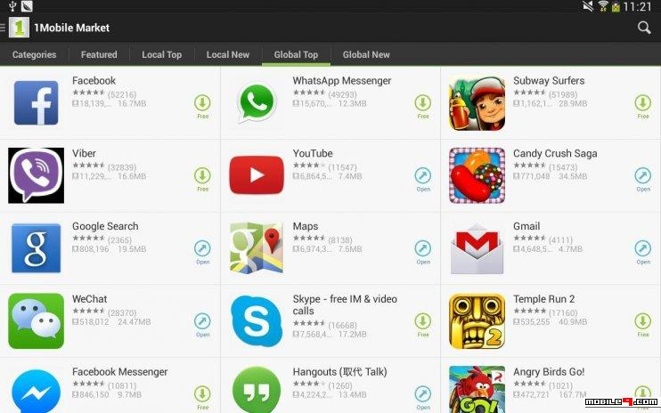

# Profitable App Profiles for the App Store and Google Play Markets

## Project Description.

Working for a company that **only build free apps to download and install** available on Google Play and in the App Store, our main source of revenue consists of in-app ads. 

This means that the number of users of our apps determines our revenue for any given app therefore the more users who see and engage with the ads, the better. 

 

Collect and analyze data from each of the online stores to understand what type of apps it would be interesting to develop to attract more users.

## Installation and libraries:

`python                    3.8.2`

In `package_libraries.txt` are all the function libraries that I have used.
