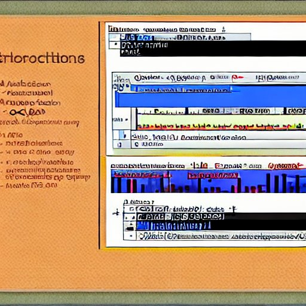

# Proyectos de Agregación y Transformación de Datos

En este repositorio, encontrarás varios proyectos relacionados con la agregación y transformación de datos. A continuación, describiré brevemente cada proyecto y su relación con los conceptos clave:

## Análisis 1: Consultas en SQL
[Connect SQLite querys in factbook NO plot](https://github.com/albertjimrod/data-projects/blob/main/05_Working_with_Data_Sources/Connect%20SQLite%20querys%20in%20factbook%20NO%20plot.ipynb)

En este análisis, me conecté a la base de datos SQLite de la CIA Factbook utilizando Jupyter y realicé consultas relevantes utilizando el lenguaje SQL. Aunque en este caso no generé gráficos, las consultas me permitieron comprender mejor el funcionamiento de SQL y responder mis propias preguntas sobre Jupyter y SQL.

### Relación con los conceptos clave:

- Data Aggregation: Utilicé consultas SQL para realizar agregaciones de datos en la base de datos de la CIA Factbook.

- Combining Data Using Pandas: Aunque no se utilizó directamente Pandas en este proyecto, se puede combinar con el análisis posterior para realizar transformaciones y agregaciones adicionales.

## Análisis 2: Visualización de Datos

[Analyzing-CIA-Factbook-Data-Using-SQL-plot](https://github.com/albertjimrod/data-projects/blob/main/05_Working_with_Data_Sources/Connect%20SQLite%20Analyzing%20CIA%20Factbook%20and%20plotting%20graphics.ipynb)

En este segundo análisis, volví a realizar la conexión con la base de datos y aproveché las herramientas de visualización disponibles en Jupyter para representar los resultados obtenidos a partir de las consultas SQL. Aquí, utilicé gráficos para visualizar los datos de la CIA Factbook y obtener información más intuitiva.

### Relación con los conceptos clave:

- Transforming Data with Pandas: Utilicé Pandas para transformar los datos obtenidos de las consultas SQL antes de visualizarlos.

- Working with Missing And Duplicate Data: Realicé una limpieza de datos previa a la visualización para manejar valores faltantes y duplicados.

- Analyzing and Visualizing the Data: Utilicé las herramientas de visualización disponibles en Jupyter para analizar y representar gráficamente los datos obtenidos.

Espero que esta breve descripción de los proyectos y su relación con los conceptos clave sea útil. Puedes acceder a cada proyecto haciendo clic en los enlaces proporcionados. ¡Disfruta explorando los proyectos!
